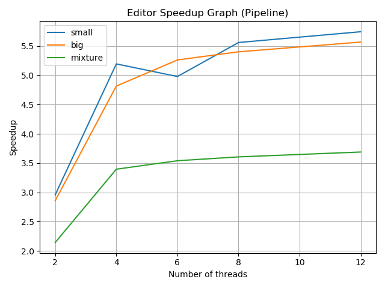
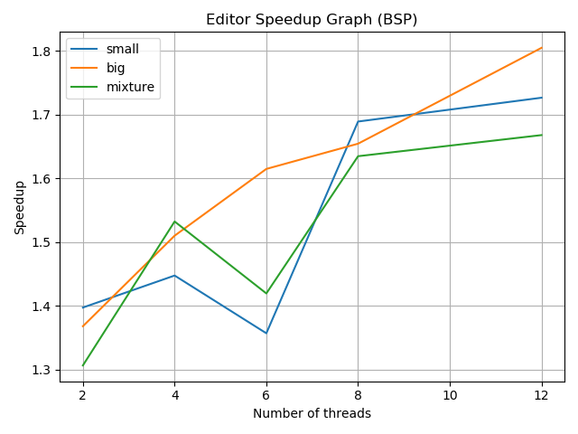

# Project: Image Editor

### Project Description - 

This project is an implementation of an image editor. Images are transformed based on a sequence of effects that are to be applied to each image along with the name of the image to be transformed and the name of the transformed image to be saved. These transformations (effects) are carried by applying specific kernels through a convolution operation over the entire image. For all effects, a 3x3 kernel is convolved over patches (iterating over the entire image). The editor processes image tasks specified in three different ways i.e. sequential, bulk synchronous parallel (bsp) and pipeline parallel.

### Important System Components - 

1. Data (Input):
    - **I/O takes places in the `proj2/data` directory. If there is no `data` directory, you can create one using `mkdir data` while inside `proj2`.**
    - Each editor task is provided within the directory `proj2/data/effects.txt` file. An example of an editor task is shown below (multiple tasks can be specified by placing one on each line of the `effects.txt` file and are in the `JSON format` - 

        ```JSON
        {"inPath": "IMG_2029.png", "outPath": "IMG_2029_Out.png", "effects": ["G","E","S"]}
        ``` 
    
    - Input images must be provided within the a directory inside `proj2/data/in` directory. If one does not exist, you can create it from within `proj2/data` using `mkdir in`. Similarly for the directory. For example, to process an image, we can create  `proj2/data/in/small` and place the image inside this directory.  
    - Input images are provided in the `PNG` format.


2. Data (Output):
    - **I/O takes places in the `proj2/data` directory. If there is no `data` directory, you can create one using `mkdir data` while inside `proj2`.**
    - After processing images, the transformed images are saved within the `proj2/data/out` directory. If one does not exist, you can create it from from within `proj2/data` using `mkdir out`. 
    - Processed images are saved in the `PNG` format.

3. Effects:
    - The following effects can be applied (the appropriate identifier to be used is specified in parenthesis for each effect) - 
        - Grayscale (G) - Each pixel's color channels are computed by averaging over the each the original pixel's color channel values.
        - Sharpen (S) - The following kernel is used as part of the convolution operation applied at every pixel using the convolution operation - 
            
            $$
            \begin{bmatrix}
            0 & -1 & 0 \\
            -1 & 5 & -1 \\
            0 & -1 & 0
            \end{bmatrix}
            $$
        
        - Blur (B) - The following kernel is used as part of the convolution operation applied at every pixel using the convolution operation - 
            
            $$
            \frac{1}{9}
            \begin{bmatrix}
            1 & 1 & 1 \\
            1 & 1 & 1 \\
            1 & 1 & 1
            \end{bmatrix}
            $$
        
        - Edge Detection (E) - The following kernel is used as part of the convolution operation applied at every pixel using the convolution operation - 
            
            $$
            \begin{bmatrix}
            -1 & -1 & -1 \\
            -1 & 8 & -1 \\
            -1 & -1 & -1
            \end{bmatrix}
            $$

    - **Note that these identifiers for each effect are case sensitive.**
    - Convolution is perform on a 2D image grid by convolving the kernel across the image. The convolution operation can be thought of as a sliding window computation over the entire image. The computation being performed is the frobenius inner product which is the sum over element wise products between the kernel and patch of image overlapping with the kernel. **Zero padding** is used at the edges of the image. The convolution operation can be seen below - 

        $$y[m,n] = x[m,n] \ast h[m,n] = \sum_{j=-\infty}^{\infty} \sum_{i=-\infty}^{\infty} x[i,j] h[m - i, n - j]$$

4. Run Modes:
    The following modes can be used with the identifier specified in parenthesis (for sequential mode, no mode is specified when running the program).
    - sequential - If no mode is specified, then the sequential version is run.
    - pipeline (pipeline) - This runs the parallel mode pipeline, which utilizes the fan-out fan-in parallelism scheme. The number of threads must be specified in this mode. Each thread spawned will work on an image tasks (all of the effects for the image task) by spawning the same number of threads for each image task, each working on a portion of the image for that effect.
    - bulk synchronous parallel (bsp) - This runs the parallel mode bsp which utilizes a bulk synchronous parallel scheme in which the number of threads (required argument) specified are spawned to work on a single effect of a single image at a time, where thread works on a patch of the image for that effect.


### Running the Program - 

The editor can be run in the following way - 

1. Sequential run - 

```console
foo@bar:~$ go run path/to/editor.go <directory>
```

2. Parallel runs - 

    1. Pipeline - 

    ```console
    foo@bar:~$ go run path/to/editor.go <image directory> pipeline <number of threads to be spawned>
    ```

    2. BSP - 

    ```console
    foo@bar:~$ go run path/to/editor.go <image directory> bsp <number of threads to be spawned>
    ```

3. Multiple Input Image Directories - 

If there a images in multiple directories within `proj2/data/in`, for example, if there was the directories `small` and `big`, we can chain directories to process using `+` - 

```console
foo@bar:~$ go run path/to/editor.go small+big pipeline <number of threads to be spawned>
```


### Benchmarking the Program - 

The program can be benchmarked using the following command - 

```console
foo@bar:~$ sbatch benchmark-proj2.sh
```

This must be run within the `benchmark directory`. Make sure to create the `slurm/out` directory inside `benchmark` directory and check the `.stdout` file for the outputs and the timings. 

### Benchmarking the Program - 

Benchmarking is done by using the `benchmark/benchmark.go`. To benchmark the application, use the following command when within the `benchmark` directory - 

```console
foo@bar:~$ sbatch benchmark.sh
```

The graph of speedups obtained can be seen below - 

1. Pipeline mode - 

    

2. BSP mode - 

    


The graphs will be created within the `benchmark` directory. The computation of the speedups along with the storing of each of the benchmarking timings and the plotting of the stored data happens by using `benchmark_graph.py` which is called from within `benchmark-proj2.sh` (both reside in the `benchmark` directory).


The following observations can be made from the **pipeline** mode graph - 

1. An overall speedup is seen for all threads tested with, on all dataset sizes. This implies that splitting the work across multiple threads allows a improvement in compute time greater than the cost of spawning and managing the threads.

2. We see that for threads **6, 8, and 12**, there is a decrease is speedup compared to previous threads or there is no additional speedup seen. This is because for each task, there are more threads spawned. This means that there are more threads to spawn and manage, therefore, the overhead cost is increased quandratically for the number of threads spawned. For the problem sizes, we are not able to amortize the cost of this overhead as much which results in a decrease, no change or small increase in speedup. An additional reason for the decrease (or no change) in speedup is because we have a machine with a certain number of logical cores available. Based on the architecture, if more threads are spawned than the number of logical cores, they will wait for a logical core to free up before being allowed to process their assigned workloads leading to increasing wait times and contention on the bus.

The following observations can be made from the **bsp** mode graph - 

1. An overall speedup is seen for all threads tested with, on all dataset sizes. This implies that splitting the work across multiple threads allows a improvement in compute time greater than the cost of spawning and managing the threads.

2. We are able to observe greater speedup as the size of the dataset increases. This is because we are able to amoritze the cost of spawning so many threads given the larger workload for each thread.

3. We see that for threads **6 and 12**, there is a decrease is speedup compared to previous threads or there is no additional speedup seen. This is because there are more threads waiting for the others to finish before moving on to the next effect/image. An additional reason for the decrease (or no change) in speedup is because we have a machine with a certain number of logical cores available. Based on the architecture, if more threads are spawned than the number of logical cores, they will wait for a logical core to free up before being allowed to process their assigned workloads leading to increasing wait times and contention on the bus. Since all threads work on one effect of one image at a time, there is a lot more time spent waiting for threads than in the pipeline version, which is why we are seeing such a decrease in speedup compared to the pipeline version.


### Questions About Implementation - 

1. What are the hotspots and bottlenecks in your sequential program?

    The hotspot in the sequential program is the convolution operation, since it needs to be applied over the entire image using a sequential 2D sliding window.

    The bottleneck in the program that one effect of one image is processed at a time, leading to a very tight bottleneck and low throughput.


2. Which parallel implementation is performing better? Why do you think it is?

   Speedup is better in the pipeline version than in bsp. Based on the architecture, if more threads are spawned than the number of logical cores, they will wait for a logical core to free up before being allowed to process their assigned workloads leading to increasing wait times and contention on the bus. Since all threads work on one effect of one image at a time, there is a lot more time spent waiting for threads than in the pipeline version, which is why we are seeing such a drastic decrease in speedup in speedup in the bsp version compared to the pipeline version. 


3. Does the problem size (i.e., the data size) affect performance?

    The increase in problem size leads to better speedup as there is more parallelism that can take place. This means that each thread can take up more work and we are able to better amortize the cost of spawning and managing the threads.


4. The Go runtime scheduler uses an N:M scheduler. However, how would the performance measurements be different if it used a 1:1 or N:1 scheduler?

    The performance measurements would be better for the bsp mode in a 1:1 scheduler since there each thread has to wait for all threads to finish before moving on to the next effect/image. By associating 1 go routine with 1 kernel thread, we will avoid contention and each thread will be able to finish it's work faster leading to less wait times for the other threads before moving on to the next effect/image task.

    The performance measurements would be better for the pipeline mode in a N:1 thread since we would enable 1 kernel thread to perform the entire workload through N go routines on an image whilst other kernel threads can work on their respective images. 


We would see increases in performance by parallelizing the convolution operation in a 2D manner i.e more are involved in the covolution operation by allocating square grids rather than strips. However, a better way would be to parallelize the kernel computation i.e. use a map reduce where each thread computes the element wise product between a kernel and patch in the image and the sum is found by accumulation over all products. This would increase performance as we are distributing the product-wise operation. As the size of the kernel increases, we would see better speedups with this parallelization scheme.


 